<](#prerequisites)
[](#prerequisites)
[](#technology-stack)
[](#database-layer)
[](#cache--pubsub-layer)
[](#license)

HMS.SYS is a production-grade, real-time surveillance platform that streams live camera feeds via **WebRTC** (mediasoup SFU), runs **four YOLO ML models in parallel** for threat detection, and delivers **sub-second anomaly alerts** to a brutalist dark-mode dashboard — all orchestrated as a **Turborepo monorepo** with single-command startup.

---

</div>

## 📑 Table of Contents

- [High-Level Architecture](#high-level-architecture)
- [System Architecture Diagram](#system-architecture-diagram)
- [Technology Stack](#technology-stack)
- [Monorepo Structure](#monorepo-structure)
- [Service Deep Dives](#service-deep-dives)
  - [1. Next.js Dashboard (`apps/web`)](#1-nextjs-dashboard-appsweb)
  - [2. Media Server (`apps/media-server`)](#2-media-server-appsmedia-server)
  - [3. ML Inference Service (`apps/ml-inference`)](#3-ml-inference-service-appsml-inference)
  - [4. ML Bridge (`apps/ml-bridge`)](#4-ml-bridge-appsml-bridge)
- [Shared Packages](#shared-packages)
- [Database Schema](#database-schema)
- [ML Model Registry](#ml-model-registry)
- [Camera Flagging System](#camera-flagging-system)
- [Alert Classification System](#alert-classification-system)
- [WebSocket Protocol Reference](#websocket-protocol-reference)
- [REST API Reference](#rest-api-reference)
- [Data Flow Workflows](#data-flow-workflows)
  - [Camera Stream Flow](#camera-stream-flow)
  - [ML Detection → Alert Pipeline](#ml-detection--alert-pipeline)
  - [Alert Broadcasting Flow](#alert-broadcasting-flow)
- [Frontend Architecture](#frontend-architecture)
- [Design System](#design-system)
- [Environment Configuration](#environment-configuration)
- [Getting Started](#getting-started)
- [Development Guide](#development-guide)
- [Troubleshooting & Known Issues](#troubleshooting--known-issues)
- [License](#license)

---

## High-Level Architecture

HMS.SYS consists of **four independent services** communicating over WebSocket, HTTP, and Redis PubSub, backed by MongoDB for persistence and Redis for real-time event broadcasting:

```
╔══════════════════════════════════════════════════════════════════════════╗
║                          HMS.SYS v3.0                                  ║
╠══════════════╦═══════════════╦════════════════╦═════════════════════════╣
║  Next.js 14  ║ Media Server  ║ ML Inference   ║     ML Bridge          ║
║  :3000       ║  :4000 (WS)   ║  :8010 (HTTP)  ║   (internal relay)     ║
║              ║  :3001 (HTTP)  ║  FastAPI       ║                        ║
║  Dashboard   ║  mediasoup SFU ║  4× YOLO .pt   ║  Detection ↔ HMS      ║
║  Auth (JWT)  ║  WS Signaling  ║  Flag Engine   ║  Alert Classification  ║
║  REST API    ║  FFmpeg Ingest ║  Alert Rules   ║  Rate Limiting         ║
╠══════════════╩═══════════════╩════════════════╩═════════════════════════╣
║             MongoDB 6                    Redis 7                       ║
║   Users · Hostels · Floors · Cameras     PubSub (alerts channel)       ║
║   Alerts · EventLogs                     Real-time broadcasting        ║
╚══════════════════════════════════════════════════════════════════════════╝
```

---

## System Architecture Diagram

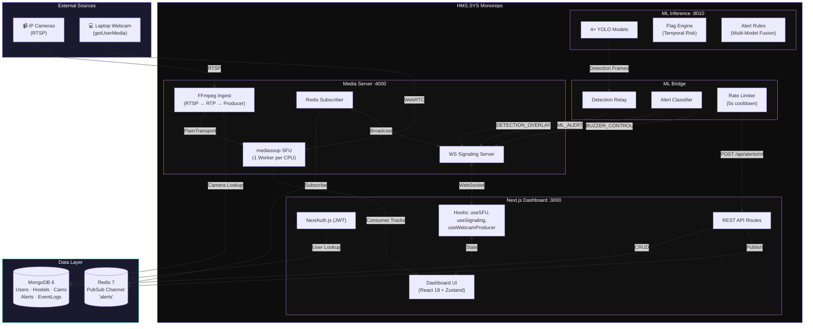

---

## Technology Stack

### Frontend — `apps/web/`

| Technology | Version | Purpose |
|---|---|---|
| **Next.js** | 14.2.35 | App Router, SSR, API routes |
| **React** | 18.x | Component UI framework |
| **TypeScript** | 5.x | Type safety |
| **Tailwind CSS** | 3.4.1 | Brutalist dark-mode styling |
| **Zustand** | 5.0.12 | State management (alerts, detections, cameras) |
| **Framer Motion** | 11.18.2 | Animations and transitions |
| **mediasoup-client** | 3.18.7 | WebRTC consumer/producer in browser |
| **next-auth** | 4.24.13 | JWT authentication (credentials provider) |
| **ioredis** | 5.10.1 | Redis PubSub for alert broadcasting |

### Media Server — `apps/media-server/`

| Technology | Version | Purpose |
|---|---|---|
| **mediasoup** | 3.13.0 | C++ WebRTC SFU engine |
| **ws** | 8.16.0 | Raw WebSocket signaling server |
| **ioredis** | 5.3.0 | Redis alert channel subscriber |
| **tsx** | 4.7.0 | Dev runner with watch mode |
| **FFmpeg** | (system) | RTSP → RTP transcoding |

### ML Inference — `apps/ml-inference/`

| Technology | Purpose |
|---|---|
| **FastAPI** | HTTP + WebSocket API server |
| **Ultralytics YOLO** | Object detection framework |
| **OpenCV** | Frame processing |
| **PyTorch** | Model inference backend |

### ML Bridge — `apps/ml-bridge/`

| Technology | Purpose |
|---|---|
| **websockets** | Async WebSocket client |
| **httpx** | Async HTTP client for HMS API |

### Infrastructure

| Technology | Version | Purpose |
|---|---|---|
| **MongoDB** | 6 | Document database (Mongoose ODM) |
| **Redis** | 7 Alpine | PubSub real-time alert broadcasting |
| **Turborepo** | 2.1.0 | Monorepo task orchestration |
| **Docker Compose** | — | MongoDB + Redis containers |

### Fonts

| Font | Usage |
|---|---|
| **Inter** | Body text (`--font-inter`) |
| **JetBrains Mono** | Monospace / terminal elements (`--font-mono`) |
| **Syne** | Display headings (`--font-syne`) |

---

## Monorepo Structure

```
Hostel-Security-System/
├── apps/
│   ├── web/                          # Next.js 14 Dashboard
│   │   ├── app/
│   │   │   ├── (auth)/
│   │   │   │   ├── login/            # Login page
│   │   │   │   └── register/         # Registration page
│   │   │   ├── api/
│   │   │   │   ├── auth/[...nextauth]/  # NextAuth handler
│   │   │   │   ├── hostels/          # Hostel CRUD
│   │   │   │   ├── cameras/          # Camera CRUD + alarm mode
│   │   │   │   └── alerts/           # Alerts: list, ML webhook, resolve, heatmap
│   │   │   ├── dashboard/
│   │   │   │   ├── page.tsx          # Main 3-column monitoring view
│   │   │   │   ├── alerts/page.tsx   # Alert history + filters
│   │   │   │   └── heatmap/page.tsx  # Threat density heatmap
│   │   │   ├── hostel/[hostelId]/    # Hostel detail view
│   │   │   ├── layout.tsx           # Root layout (fonts, providers)
│   │   │   ├── page.tsx             # Landing page (brutalist hero)
│   │   │   └── globals.css          # CSS variables, effects, marquee
│   │   ├── components/
│   │   │   ├── Navbar.tsx           # Top navigation bar
│   │   │   ├── CameraFeedCard.tsx   # Camera video tile + live overlay
│   │   │   ├── CameraModal.tsx      # Full camera detail modal
│   │   │   ├── DetectionOverlay.tsx # SVG bounding box overlay
│   │   │   ├── ZoneEditor.tsx       # Canvas restricted zone editor
│   │   │   ├── AlarmControl.tsx     # Audio alarm panel (Web Audio API)
│   │   │   └── providers/
│   │   │       ├── AlertProvider.tsx # WS alert subscription
│   │   │       └── AuthProvider.tsx  # next-auth session wrapper
│   │   ├── hooks/
│   │   │   ├── useSignaling.ts      # WS singleton + reconnect
│   │   │   ├── useSFU.ts            # mediasoup consumer lifecycle
│   │   │   └── useWebcamProducer.ts # Webcam broadcasting
│   │   ├── stores/
│   │   │   ├── alertStore.ts        # Zustand: alerts, unread count
│   │   │   ├── detectionStore.ts    # Zustand: ML boxes, alarms, heatmap
│   │   │   └── cameraStore.ts       # Zustand: camera online status
│   │   └── lib/
│   │       ├── auth.ts              # getSession helper
│   │       └── ml-interface.ts      # ML request/response types
│   │
│   ├── media-server/                 # mediasoup SFU + Signaling
│   │   ├── src/
│   │   │   ├── index.ts             # Entry: workers, WS, Redis, health
│   │   │   ├── signaling/
│   │   │   │   └── ws-server.ts     # WebSocket handlers (SFU + ML)
│   │   │   ├── mediasoup/
│   │   │   │   ├── workers.ts       # Worker/Router (1 per CPU, VP8)
│   │   │   │   ├── transport.ts     # WebRTC transport management
│   │   │   │   └── ingest.ts        # FFmpeg RTSP → PlainTransport
│   │   │   └── redis/
│   │   │       └── subscriber.ts    # Redis 'alerts' channel listener
│   │   └── package.json
│   │
│   ├── ml-inference/                 # FastAPI ML Detection Service
│   │   ├── detectsvc/
│   │   │   ├── __init__.py
│   │   │   ├── main.py              # FastAPI app + WebSocket endpoints
│   │   │   ├── config.py            # Configuration from env
│   │   │   ├── registry.py          # Model registry + YOLO loader
│   │   │   ├── pipeline/            # Frame processing pipeline
│   │   │   └── accel/               # GPU acceleration utilities
│   │   ├── flag_engine.py           # Camera temporal risk flagging
│   │   ├── alert_rules.py           # Multi-model alert fusion logic
│   │   ├── run.py                   # Entry point
│   │   └── requirements.txt
│   │
│   └── ml-bridge/                    # Detection → HMS Relay
│       ├── bridge.py                # Main relay script
│       ├── requirements.txt         # websockets, httpx
│       └── .env.example
│
├── packages/
│   ├── db/                           # Database Layer (shared)
│   │   ├── src/
│   │   │   ├── index.ts             # connectDB() singleton
│   │   │   ├── schema.ts            # 6 Mongoose schemas
│   │   │   └── seed.ts              # Database seeder
│   │   └── package.json
│   │
│   ├── types/                        # Shared TypeScript Types
│   │   ├── src/
│   │   │   ├── index.ts             # Re-exports
│   │   │   ├── hostel.ts            # HostelConfig + HOSTEL_CONFIG map
│   │   │   └── websocket.ts         # WS message types, payloads, enums
│   │   └── package.json
│   │
│   ├── ui/                           # Shared React Components
│   │   ├── src/
│   │   │   └── index.tsx            # Button, Badge, StatusDot, Card
│   │   └── package.json
│   │
│   └── config/                       # Shared Config
│       ├── eslint/                  # ESLint preset
│       ├── tailwind/                # Tailwind preset
│       └── typescript/              # tsconfig base
│
├── ml/
│   └── models/                       # YOLO Model Weights (.pt)
│       ├── model1.pt               # Action/Pose (53 MB)
│       ├── model2.pt               # Pattern Recognition (6 MB)
│       ├── monkey_cat_dog_v1.pt    # Animal Detection (6 MB)
│       └── weapons.pt              # Weapon Detection (5.6 MB)
│
├── docker-compose.yml                # MongoDB 6 + Redis 7
├── turbo.json                        # Turborepo task pipeline
├── start.ps1                         # Windows startup script
├── scripts/start.sh                  # Unix/macOS startup script
├── package.json                      # Root monorepo config
└── .env.example                      # Root env template
```

---

## Service Deep Dives

### 1. Next.js Dashboard (`apps/web`)

The primary user-facing application — a brutalist dark-mode dashboard built with Next.js 14 App Router.

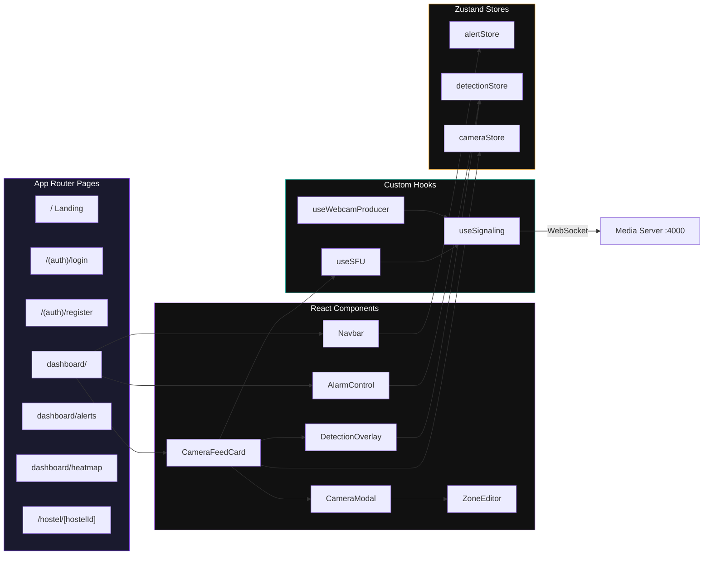

#### Pages

| Route | Description |
|---|---|
| `/` | Brutalist landing page with SVG pipeline diagram |
| `/(auth)/login` | Credentials login form |
| `/(auth)/register` | User registration |
| `/dashboard` | Main 3-column view: sector panel, live feeds, diagnostics |
| `/dashboard/alerts` | Alert history with type/severity filters and detail drawer |
| `/dashboard/heatmap` | Threat density heatmap (camera grid, color-coded by risk) |
| `/hostel/[hostelId]` | Individual hostel detail view |

#### Components

| Component | Responsibility |
|---|---|
| `Navbar.tsx` | Fixed top navigation, alert bell badge, user logout |
| `CameraFeedCard.tsx` | Video tile with LIVE badge, surveillance toggle, overlay |
| `CameraModal.tsx` | Full-screen modal: Info tab (history) + Zones tab (editor) |
| `DetectionOverlay.tsx` | SVG bounding boxes color-coded by class + corner markers |
| `ZoneEditor.tsx` | Canvas polygon tool for defining restricted zones |
| `AlarmControl.tsx` | Fixed bottom-right panel: Web Audio API siren, per-camera modes |

#### Hooks

| Hook | Behavior |
|---|---|
| `useSignaling` | Singleton WebSocket to :4000. Auto-reconnect (1s→30s backoff). Ping/Pong every 25s. `request()` + `subscribe()` API. |
| `useSFU` | Full mediasoup consumer lifecycle: capabilities → transport → join floor → consume producers → cleanup |
| `useWebcamProducer` | getUserMedia → send transport → produce video track → round-robin camera mapping |

#### Zustand Stores

| Store | State |
|---|---|
| `alertStore` | `alerts[]` (max 100), `unreadCount`, `addAlert()`, `resolveAlert()` |
| `detectionStore` | `detectionBoxes` Map, `alarmState` Map, `heatmapData` Map, `surveillanceStatus` Map, `zoneAlerts[]` |
| `cameraStore` | `onlineStatus` Map per camera |

---

### 2. Media Server (`apps/media-server`)

A standalone **Node.js** daemon running the **mediasoup** C++ SFU engine with custom WebSocket signaling.

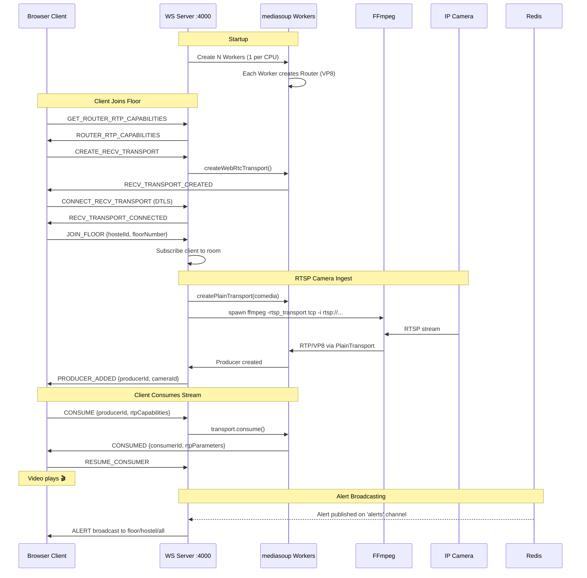

#### Startup Sequence

1. **Initialize mediasoup Workers** — 1 Worker per CPU core, each with a VP8 Router
2. **Start WebSocket Signaling** on port 4000
3. **Start Redis Subscriber** on the `alerts` channel
4. **Start HTTP Health Endpoint** on port 3001 (`/health`)
5. **Register SIGINT/SIGTERM** handlers for graceful shutdown

#### FFmpeg RTSP Ingest

For each camera with an RTSP URL:
```bash
ffmpeg -rtsp_transport tcp -i rtsp://<camera_url> \
       -an -vcodec libvpx -b:v 800k -r 15 \
       -f rtp -payload_type 96 -ssrc 11111111 \
       rtp://127.0.0.1:<dynamic_port>
```

- **comedia mode**: auto-detects FFmpeg's source port
- **Auto-stop**: after 45s with zero consumers
- **Auto-retry**: up to 3 attempts on FFmpeg exit (5s delay between)

---

### 3. ML Inference Service (`apps/ml-inference`)

A **FastAPI** service loading 4 YOLO models in parallel for real-time frame analysis.

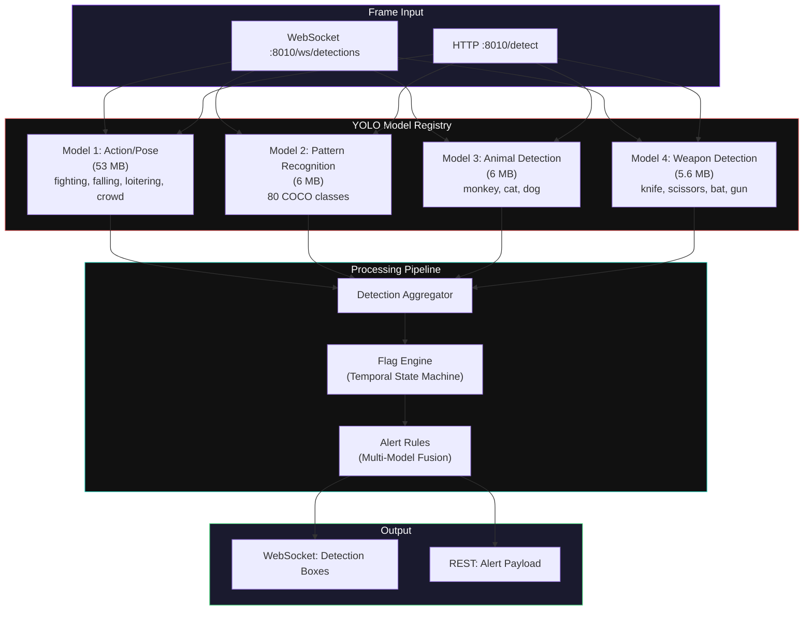

#### Flag Engine (`flag_engine.py`)

The flag engine maintains a **temporal state machine** per camera, tracking risk transitions:

| Flag | Trigger Condition | Color | Duration / Reset |
|---|---|---|---|
| `CLEAR` | No active threats | 🟢 Green | Default state |
| `ANIMAL` | Animal in frame > 60s | 🟡 Yellow | Clears after 30s absence |
| `FIGHT` | Fighting detected ≥ 55% confidence | 🔴 Red | Clears after 45s absence |
| `WEAPON` | Weapon detected ≥ 60% confidence | 🔴 Red | **Manual resolve only** |

#### Alert Rules (`alert_rules.py`)

Multi-model fusion logic that cross-validates detections:
- **FIGHT**: Model 1 (fighting) + Model 2 (person confirmation) → HIGH severity
- **WEAPON**: Model 4 standalone → CRITICAL severity
- **TRESPASSING**: Model 2 (person) + Zone intersection → HIGH severity
- **ANIMAL**: Model 3 + duration threshold → MEDIUM severity

---

### 4. ML Bridge (`apps/ml-bridge`)

A **Python relay service** that bridges the ML Inference Service with HMS.

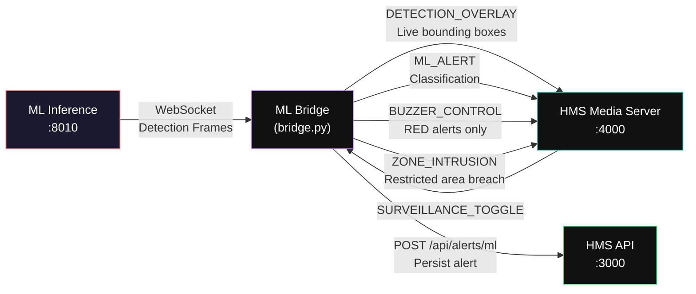

#### Main Loop (`relay_detections`)

1. Connect to HMS Media Server WebSocket (:4000)
2. Start HMS WS listener (handles `SURVEILLANCE_TOGGLE`)
3. Start zone sync loop (every 10s: fetch zones → push to detector)
4. Connect to Detection Service WebSocket (:8010)
5. For each detection frame:
   - Check surveillance is active for camera
   - Forward `DETECTION_OVERLAY` to HMS WS (live bounding boxes)
   - For each box with confidence ≥ 0.45:
     - Classify detection type + risk level
     - Zone intrusions → elevate to RED + send `ZONE_INTRUSION`
     - **Rate-limited** (5s cooldown per camera+class):
       - `POST` alert to `/api/alerts/ml`
       - Send `ML_ALERT` via WS
       - RED alerts → send `BUZZER_CONTROL` (trigger alarm)

#### Detection Classification

| Class Group | YOLO Classes | Alert Type | Risk Level |
|---|---|---|---|
| **Animals** | dog, cat, bird, horse, cow, monkey | `ANIMAL_INTRUSION` | 🟡 YELLOW |
| **Weapons** | knife, scissors, baseball bat, gun | `WEAPON` | 🔴 RED |
| **Fire** | fire, smoke | `FIRE_DETECTED` | 🔴 RED |
| **Food** | pizza, bottle, cup, banana, etc. | `FOOD_INTRUSION` | 🟡 YELLOW |
| **Person** | person | `UNAUTHORIZED_PERSON` | 🟡 YELLOW |

---

## Shared Packages

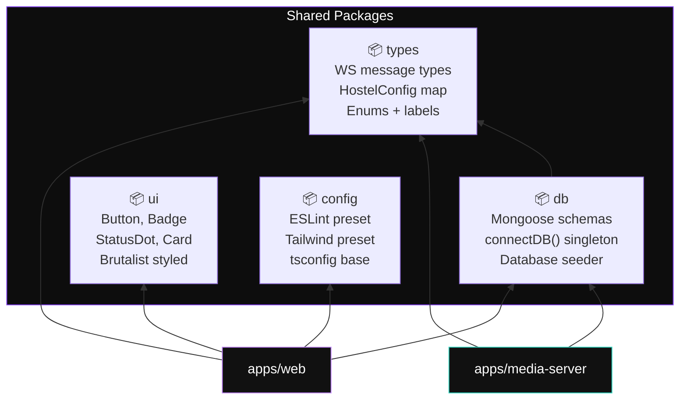

| Package | Contents |
|---|---|
| `packages/db` | `connectDB()` singleton, 6 Mongoose schemas (User, Hostel, Floor, Camera, Alert, EventLog), database seeder |
| `packages/types` | All WebSocket message types, payload interfaces, enums, `HOSTEL_CONFIG` map, `ALERT_TYPE_EMOJI` / `ALERT_TYPE_LABEL` / `SEVERITY_COLOR` maps |
| `packages/ui` | Shared React components: `Button`, `Badge`, `StatusDot`, `Card` — all brutalist-styled |
| `packages/config` | Shared ESLint, Tailwind, and TypeScript configurations |

---

## Database Schema

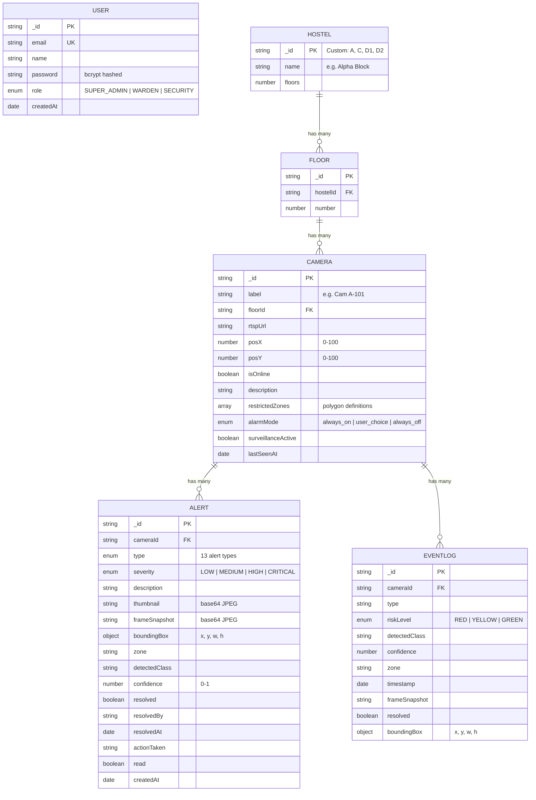

### Seed Data

- **Admin User**: `admin@hostel.com` / `password123` (role: `SUPER_ADMIN`)
- **Hostels**: A (Alpha Block, 15 floors), C (Beta Block, 16 floors)
- **Cameras**: 2 per floor (e.g., `Cam A-101`, `Cam A-102`)
- **Alerts**: Random alerts seeded on ~30% of cameras

---

## ML Model Registry

All models use the [Ultralytics YOLO](https://docs.ultralytics.com/) framework and are stored in `ml/models/`.

| # | File | Size | Purpose | Classes |
|---|---|---|---|---|
| 1 | `model1.pt` | 53 MB | Action & Pose Detection | fighting, falling, loitering, crowd |
| 2 | `model2.pt` | 6 MB | Pattern Recognition | 80 COCO classes (person, car, bag…) |
| 3 | `monkey_cat_dog_v1.pt` | 6 MB | Animal Detection | monkey, cat, dog |
| 4 | `weapons.pt` | 5.6 MB | Weapon Detection | knife, scissors, bat, gun |

### Model Inference Pipeline

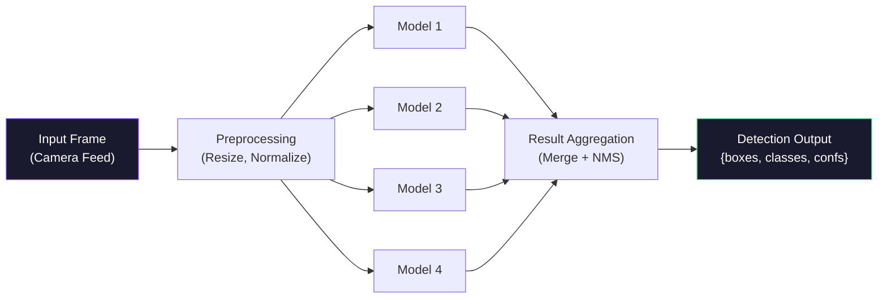

---

## Camera Flagging System

The flag system tracks **per-camera temporal risk state**. Flag transitions are driven by detection confidence thresholds and duration rules.

```mermaid
stateDiagram-v2
    [*] --> CLEAR

    CLEAR --> ANIMAL : Animal detected > 60s
    CLEAR --> FIGHT : Fighting ≥ 55% conf
    CLEAR --> WEAPON : Weapon ≥ 60% conf

    ANIMAL --> CLEAR : 30s absence
    FIGHT --> CLEAR : 45s absence
    WEAPON --> RESOLVED : Manual resolve only

    RESOLVED --> CLEAR : Admin action

    state CLEAR {
        direction LR
        note right of CLEAR : 🟢 GREEN — No threats
    }

    state ANIMAL {
        direction LR
        note right of ANIMAL : 🟡 YELLOW — Caution
    }

    state FIGHT {
        direction LR
        note right of FIGHT : 🔴 RED — Danger
    }

    state WEAPON {
        direction LR
        note right of WEAPON : 🔴 RED — Critical
    }
```

---

## Alert Classification System

| Type | Emoji | Severity | Trigger |
|---|---|---|---|
| `FIGHT` | 👊 | HIGH | Physical altercation detected |
| `LIQUOR` | 🍺 | HIGH | Alcohol containers detected |
| `SMOKING` | 🚬 | MEDIUM | Smoking activity detected |
| `ANIMAL_MONKEY` | 🐒 | MEDIUM | Monkey spotted on premises |
| `ANIMAL_DOG` | 🐕 | MEDIUM | Dog spotted on premises |
| `UNAUTHORIZED_PERSON` | 🚷 | MEDIUM | Unrecognized person detected |
| `WEAPON` | 🔫 | CRITICAL | Knife/scissors/bat/gun detected |
| `ANIMAL_INTRUSION` | 🐾 | MEDIUM | General animal intrusion |
| `LOITERING` | 🚶 | MEDIUM | Prolonged presence detected |
| `CROWD_SURGE` | 👥 | HIGH | Unusual crowd density |
| `TRESPASSING` | 🚫 | HIGH | Entry to restricted area |
| `FOOD_INTRUSION` | 🍕 | LOW | Food items (attracting animals) |
| `FIRE_DETECTED` | 🔥 | CRITICAL | Fire or smoke detected |

### Severity Levels

| Level | Color | Use Case |
|---|---|---|
| `LOW` | Gray | Informational (food, minor anomaly) |
| `MEDIUM` | Amber | Caution (animals, smoking, loitering) |
| `HIGH` | Red | Danger (fights, crowds, trespassing) |
| `CRITICAL` | Dark Red | Immediate action (weapons, fire) |

---

## WebSocket Protocol Reference

**Server**: `ws://localhost:4000`  
**Message Envelope**: `{ type: WSMessageType, id?: string, payload: T, timestamp: number }`

### SFU Signaling

| Direction | Type | Payload |
|---|---|---|
| `→` Client | `GET_ROUTER_RTP_CAPABILITIES` | — |
| `←` Server | `ROUTER_RTP_CAPABILITIES` | `{ rtpCapabilities }` |
| `→` Client | `CREATE_RECV_TRANSPORT` | — |
| `←` Server | `RECV_TRANSPORT_CREATED` | `{ id, iceParameters, iceCandidates, dtlsParameters }` |
| `→` Client | `CONNECT_RECV_TRANSPORT` | `{ transportId, dtlsParameters }` |
| `←` Server | `RECV_TRANSPORT_CONNECTED` | — |
| `→` Client | `CREATE_SEND_TRANSPORT` | — |
| `←` Server | `SEND_TRANSPORT_CREATED` | `{ id, iceParameters, iceCandidates, dtlsParameters }` |
| `→` Client | `CONNECT_SEND_TRANSPORT` | `{ transportId, dtlsParameters }` |
| `←` Server | `SEND_TRANSPORT_CONNECTED` | — |
| `→` Client | `PRODUCE` | `{ transportId, kind, rtpParameters }` |
| `←` Server | `PRODUCED` | `{ id: producerId }` |
| `→` Client | `CONSUME` | `{ producerId, transportId, rtpCapabilities }` |
| `←` Server | `CONSUMED` | `{ consumerId, producerId, kind, rtpParameters, cameraId }` |
| `→` Client | `RESUME_CONSUMER` | `{ consumerId }` |

### Room Management

| Direction | Type | Payload |
|---|---|---|
| `→` | `JOIN_FLOOR` | `{ hostelId, floorNumber }` |
| `←` | `PRODUCER_ADDED` | `{ producerId, cameraId, cameraLabel, hostelId, floorNumber }` |
| `→` | `LEAVE_FLOOR` | `{ hostelId, floorNumber }` |
| `←` | `PRODUCER_REMOVED` | `{ producerId, cameraId }` |

### ML / Intrusion Detection

| Direction | Type | Payload |
|---|---|---|
| `←` | `ALERT` | `{ alertId, cameraId, cameraLabel, hostelId, floorNumber, alertType, severity, description, thumbnail, posX, posY }` |
| `↔` | `BUZZER_CONTROL` | `{ cameraId, action: on\|off, tone: high\|low }` |
| `↔` | `SURVEILLANCE_TOGGLE` | `{ cameraId, active: boolean }` |
| `↔` | `DETECTION_OVERLAY` | `{ cameraId, boxes[], fps, width, height }` |
| `↔` | `ZONE_INTRUSION` | `{ cameraId, zone, cls, confidence, riskLevel }` |
| `↔` | `ML_ALERT` | Full detection alert from bridge |
| `↔` | `HEATMAP_UPDATE` | `{ cameraId, riskLevel, alertCount }` |
| `↔` | `WALKTHROUGH_STATUS` | `{ cameraId, checkedAt }` |

### Keepalive

| Direction | Type | Interval |
|---|---|---|
| `→` | `PING` | Every 25 seconds |
| `←` | `PONG` | Immediate response |

---

## REST API Reference

**Base URL**: `http://localhost:3000/api`

### Authentication

| Method | Endpoint | Description |
|---|---|---|
| `POST` | `/api/auth/[...nextauth]` | NextAuth credentials provider (JWT sessions) |

### Hostels

| Method | Endpoint | Description |
|---|---|---|
| `GET` | `/api/hostels` | All hostels with aggregated stats: `{ id, name, floors, onlineCameras, activeAlerts }` |
| `GET` | `/api/hostels/[hostelId]` | Single hostel with populated floors and cameras |

### Cameras

| Method | Endpoint | Description |
|---|---|---|
| `GET` | `/api/cameras/[id]` | Camera detail with floor, hostel, and recent alerts |
| `PATCH` | `/api/cameras/[id]/alarm-mode` | Update alarm mode. Body: `{ alarmMode: string }` |

### Alerts

| Method | Endpoint | Description |
|---|---|---|
| `GET` | `/api/alerts` | Paginated list. Filters: `page, limit, hostelId, floorNumber, cameraId, type, severity, resolved` |
| `GET` | `/api/alerts/history` | Same with full pagination metadata |
| `POST` | `/api/alerts/ml` | **ML webhook** (secured by `x-api-key` header). Creates Alert + EventLog |
| `PATCH` | `/api/alerts/[id]/resolve` | Mark resolved. Body: `{ actionTaken: string }` |
| `PATCH` | `/api/alerts/[id]/read` | Mark as read |
| `GET` | `/api/alerts/heatmap` | Aggregated counts per camera. Query: `window=1h\|6h\|24h\|7d` |

---

## Data Flow Workflows

### Camera Stream Flow

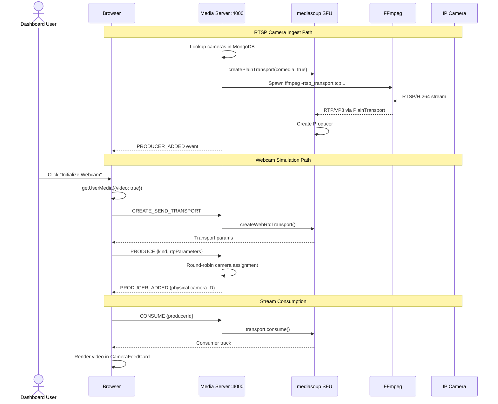

### ML Detection → Alert Pipeline

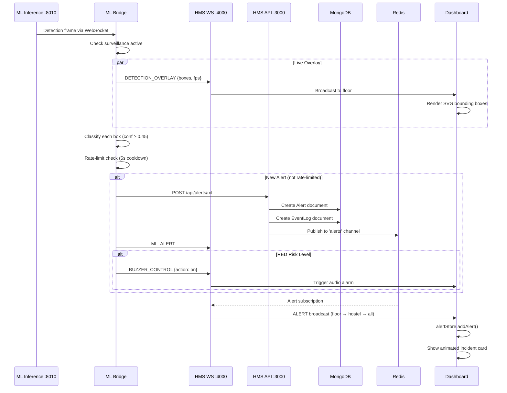

### Alert Broadcasting Flow

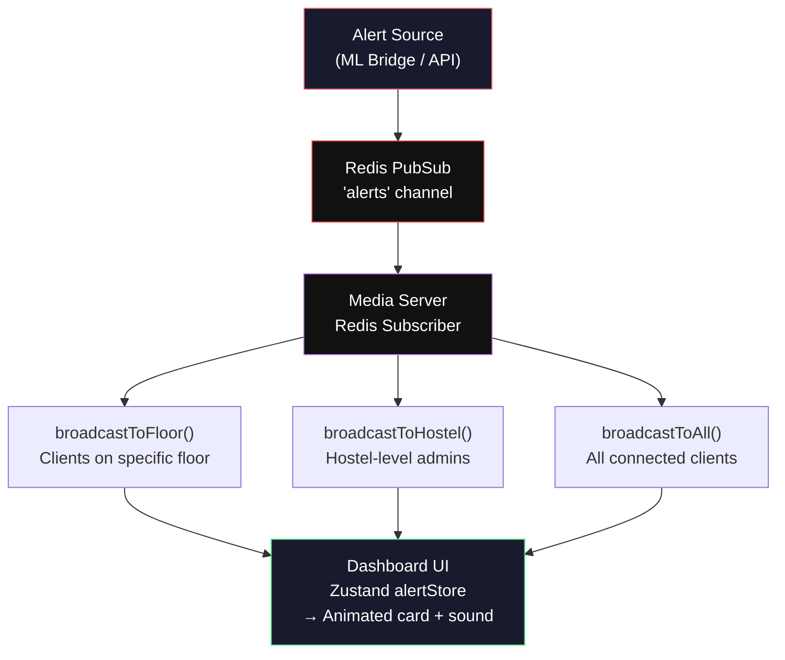

---

## Frontend Architecture

### State Management Flow

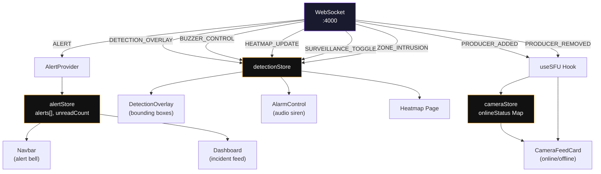

### Where ML Inference Appears

| Location | Component | Data Source |
|---|---|---|
| **Live Bounding Boxes** | `DetectionOverlay.tsx` on `CameraFeedCard` | `DETECTION_OVERLAY` → `detectionStore` |
| **Incident Feed** | Dashboard center column | `ALERT` → `alertStore` → animated cards |
| **Threat Heatmap** | `/dashboard/heatmap` | `GET /api/alerts/heatmap` |
| **Alert History** | `/dashboard/alerts` | `GET /api/alerts/history` with filters |

---

## Design System

### Color Palette

| Token | Value | Usage |
|---|---|---|
| Background | `#000000` | Pure black base |
| Surface | `rgba(124, 58, 237, 0.02)` | Card backgrounds |
| Surface Elevated | `rgba(124, 58, 237, 0.05)` | Hover states |
| Border | `rgba(124, 58, 237, 0.25)` | Default borders |
| Border Hover | `rgba(124, 58, 237, 0.6)` | Interactive borders |
| Text Primary | `#FFFFFF` | Main text |
| Text Secondary | `#8E8E8E` | Muted text |
| Accent Violet | `#C084FC` / `#7C3AED` | Primary accent |
| Accent Cyan | `#2DD4BF` / `#00D4FF` | Secondary accent |
| Alert Red | `#F87171` / `#ef4444` | Danger states |
| Online Green | `#4ADE80` / `#22c55e` | Active/online |
| Warning Amber | `#FBBF24` / `#f59e0b` | Warning states |
| Offline Gray | `#52525B` / `#3f3f46` | Disabled/offline |

### Design Principles

- **BRUTALIST**: Zero border-radius globally (`* { border-radius: 0 !important; }`)
- Pure black backgrounds with subtle purple dithered pattern
- Monospace fonts for terminal/military aesthetic
- Status indicators: colored **squares** (not circles)
- Marquee ticker bars with scrolling text
- Scanline overlays on video feeds
- No rounded corners, no soft shadows
- Sharp borders, bold tracking, uppercase text

---

## Environment Configuration

### Root `.env`

```env
MONGODB_URI="mongodb://localhost:27017/hostel_monitor"
REDIS_URL="redis://localhost:6379"
NEXTAUTH_SECRET="your-super-secret-key-change-in-production"
NEXTAUTH_URL="http://localhost:3000"
NEXT_PUBLIC_MEDIA_SERVER_WS_URL="ws://localhost:4000"
ML_API_KEY="ml-service-api-key-change-in-production"
ANNOUNCED_IP="127.0.0.1"              # LAN IP for cross-device WebRTC
RTC_MIN_PORT=40000                     # mediasoup RTP port range start
RTC_MAX_PORT=49999                     # mediasoup RTP port range end
```

### `apps/ml-inference/.env`

```env
DETECT_PORT=8010
MODELS_ROOT=../../ml/models
CONF_THRESHOLD_ACTION=0.55
CONF_THRESHOLD_WEAPON=0.60
FLAG_ANIMAL_DURATION_SEC=60
INFERENCE_FPS=5
```

### `apps/ml-bridge/.env`

```env
HMS_API_URL=http://localhost:3000
HMS_WS_URL=ws://localhost:4000
DETECTION_WS_URL=ws://localhost:8010/ws/detections
DETECTION_API_URL=http://localhost:8010
ML_API_KEY=hms-ml-key-2026
CAMERA_ID=default
```

### Port Reference

| Port | Service | Protocol |
|---|---|---|
| `3000` | Next.js Dashboard | HTTP |
| `3001` | Media Server Health | HTTP (`/health`) |
| `4000` | Media Server (mediasoup) | WebSocket |
| `8010` | ML Inference Service | HTTP + WebSocket |
| `27017` | MongoDB | TCP |
| `6379` | Redis | TCP |
| `40000–49999` | mediasoup RTP Ports | UDP/TCP |

> ⚠️ **Critical**: `ANNOUNCED_IP` must be set to the machine's **LAN IP** for cross-device WebRTC. Using `127.0.0.1` works only for same-machine testing. `ML_API_KEY` must match between `web/.env` and `ml-bridge/.env`.

---

## Getting Started

### Prerequisites

| Requirement | Minimum Version |
|---|---|
| Node.js | ≥ 18.0 |
| npm | ≥ 10.0 |
| Python | ≥ 3.9 |
| MongoDB | 6.x (local or Docker) |
| Redis | 7.x (local or Docker) |
| FFmpeg | Latest (for RTSP ingest) |

### Installation

```bash
# 1. Clone the repository
git clone <repo-url>
cd Hostel-Security-System

# 2. Install Node.js dependencies
npm install

# 3. Install Python dependencies (ML Inference)
pip install -r apps/ml-inference/requirements.txt

# 4. Install Python dependencies (ML Bridge)
pip install -r apps/ml-bridge/requirements.txt

# 5. Start infrastructure (MongoDB + Redis)
docker compose up -d

# 6. Set up environment variables
cp .env.example .env                                    # Root
cp apps/ml-inference/.env.example apps/ml-inference/.env  # ML Inference
cp apps/ml-bridge/.env.example apps/ml-bridge/.env        # ML Bridge
# Edit .env files with your MongoDB URI, LAN IP, etc.

# 7. Seed the database
npm run db:seed

# 8. Start everything (single command)
.\start.ps1                   # Windows (PowerShell)
# OR
bash scripts/start.sh         # Linux/macOS
```

### Startup Workflow

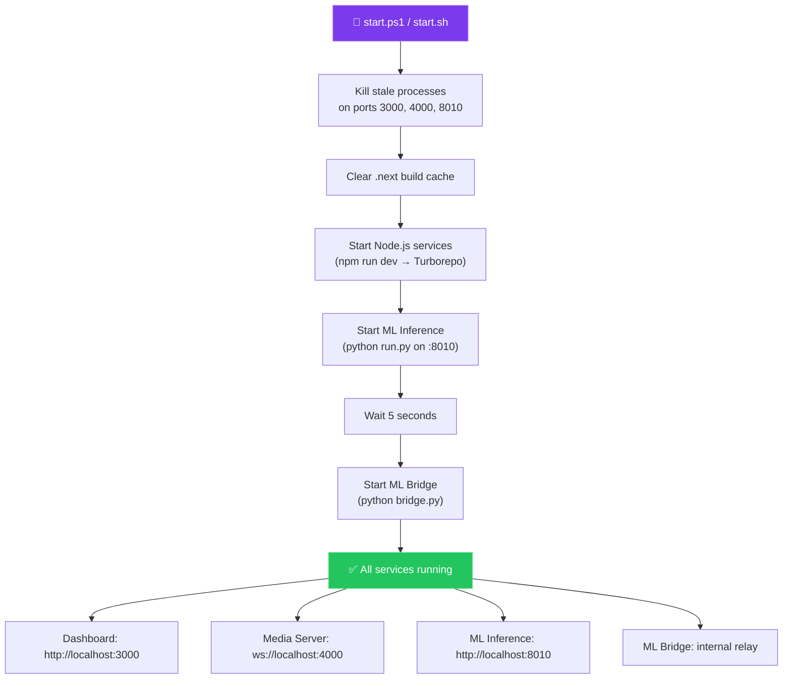

### Default Credentials

| Field | Value |
|---|---|
| **Email** | `admin@hostel.com` |
| **Password** | `password123` |
| **Role** | `SUPER_ADMIN` |

---

## Development Guide

### Running Individual Services

```bash
# Run only the web dashboard
npx turbo run dev --filter=@hostel-monitor/web

# Run only the media server
npx turbo run dev --filter=@hostel-monitor/media-server

# Run the ML inference service
cd apps/ml-inference && python run.py

# Run the ML bridge
cd apps/ml-bridge && python bridge.py
```

### Turborepo Task Pipeline

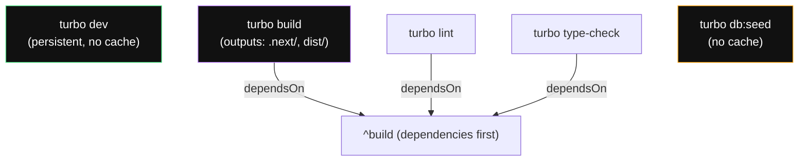

### Available Scripts

| Script | Command | Description |
|---|---|---|
| `dev` | `turbo run dev` | Start all services in dev mode |
| `build` | `turbo run build` | Production build (all apps) |
| `lint` | `turbo run lint` | Lint all workspaces |
| `type-check` | `turbo run type-check` | TypeScript type checking |
| `format` | `prettier --write "**/*.{ts,tsx,js,jsx,json,md}"` | Format all files |
| `db:seed` | `turbo run db:seed` | Seed the database |

---

## Hostel Configuration

Defined in `packages/types/src/hostel.ts`:

| ID | Name | Floors | Color | Description |
|---|---|---|---|---|
| `A` | Hostel A | 15 | `#3b82f6` | Main academic hostel |
| `C` | Hostel C | 16 | `#22c55e` | Central hostel complex |
| `D1` | Hostel D1 | 16 | `#f59e0b` | D-block tower 1 |
| `D2` | Hostel D2 | 16 | `#a855f7` | D-block tower 2 |

> Seed data creates hostels **A** (Alpha Block) and **C** (Beta Block). D1 and D2 are configured but not seeded by default.

---

## Troubleshooting & Known Issues

| Issue | Root Cause | Solution |
|---|---|---|
| WebRTC video not showing on other devices | `ANNOUNCED_IP` set to `127.0.0.1` | Set to machine's LAN IP (e.g., `192.168.1.100`) |
| 404 errors on `/api/hostels/A` | Database not seeded | Run `npm run db:seed` |
| `CameraModal.tsx` duplicate import errors | Duplicate `ALERT_TYPE_EMOJI` import (lines 7 & 11) | Remove duplicate import |
| Redis unavailable | Redis container not running | Alerts still work via API but won't broadcast in real time |
| ML Bridge connection refused | Inference service not running on :8010 | Start ML Inference first, Bridge auto-retries |
| Webcam camera mapping resets | Media server restarted | Assignment counter is in-memory; restart resets round-robin |
| Ports in use after crash | Stale processes on 3000/4000/8010 | `start.ps1` / `start.sh` auto-kills stale processes |
| mediasoup worker dies | Worker crash | Process exits after 2s and must be restarted |

---

## License

**Private** — Solve-a-thon 2026
]]>
