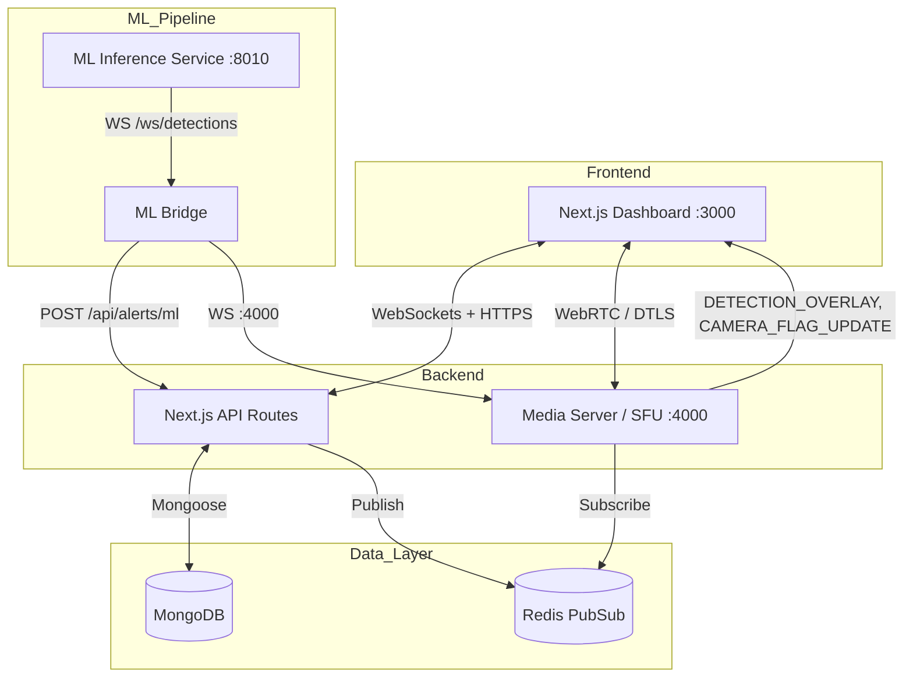
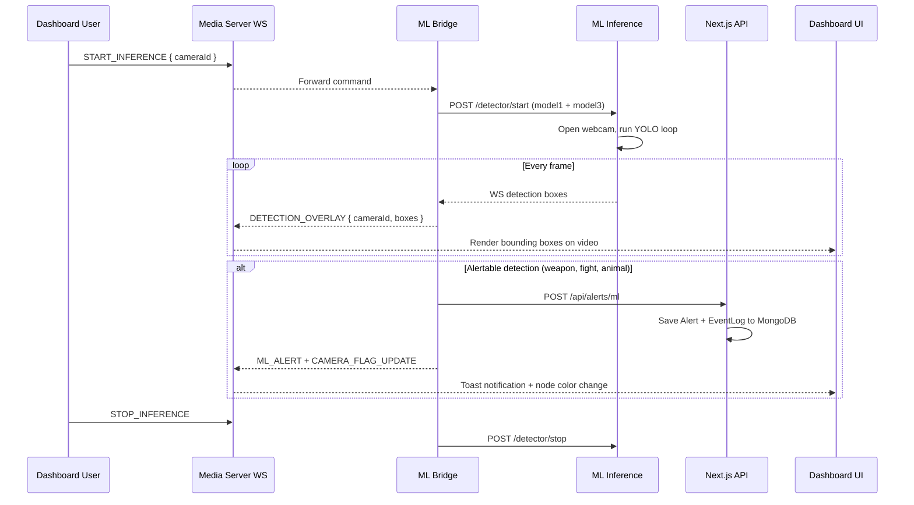
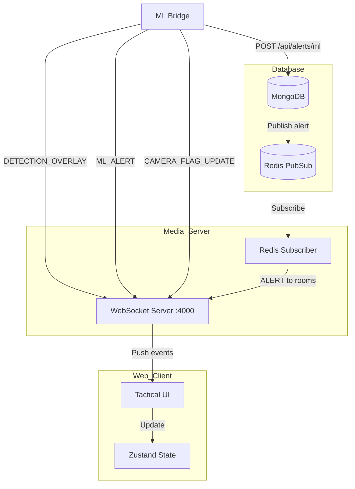
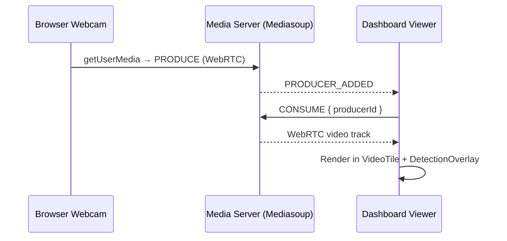
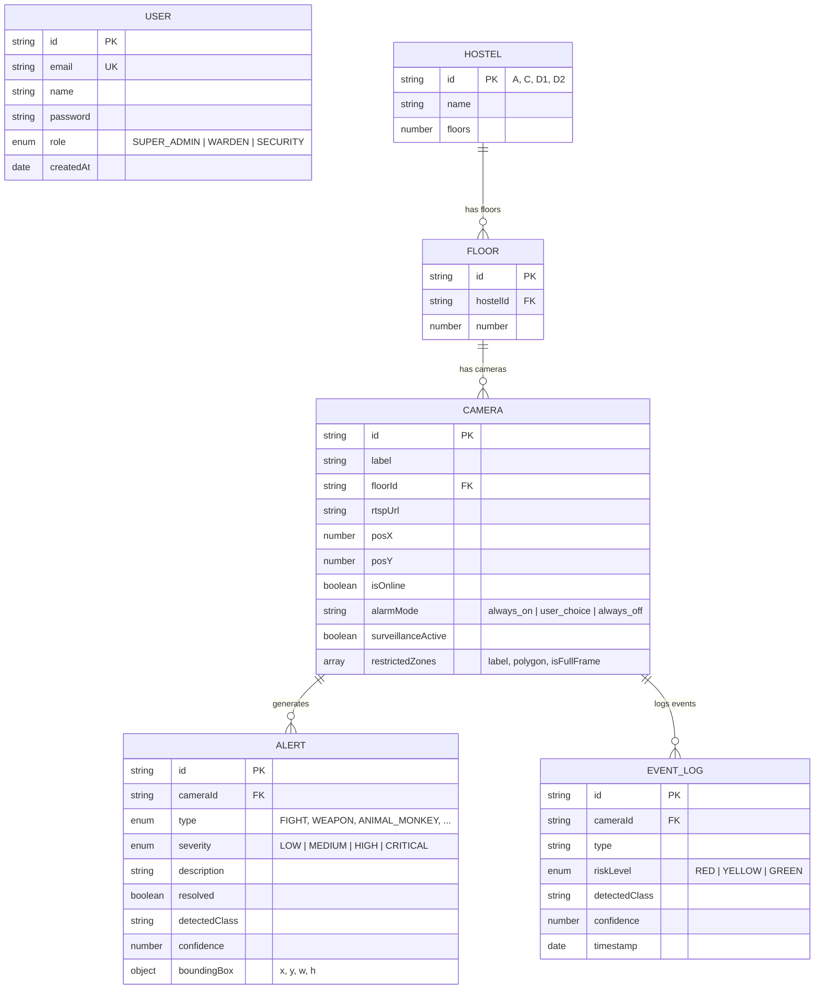

# HMS.SYS — Hostel Monitoring System

> Real-time, AI-powered campus surveillance built on WebRTC, YOLOv8, and instant WebSocket telemetry.
> Four YOLO models run simultaneously, fuse detections across action, animal, and weapon categories, and push sub-second alerts to a brutalist tactical dashboard.

---

## Table of Contents

- [Architecture Overview](#architecture-overview)
- [Service Map](#service-map)
- [ML Detection Pipeline](#ml-detection-pipeline)
- [Real-Time PubSub & WebSocket Engine](#real-time-pubsub--websocket-engine)
- [Media Data Flow](#media-data-flow)
- [Monorepo Structure](#monorepo-structure)
- [Database Schema](#database-schema)
- [API Reference](#api-reference)
- [WebRTC Signaling Protocol](#webrtc-signaling-protocol)
- [ML Models](#ml-models)
- [Quickstart](#quickstart)
- [Environment Variables](#environment-variables)
- [Security](#security)
- [Tech Stack](#tech-stack)

---

## Architecture Overview

HMS.SYS is a monorepo with four independent services coordinated via WebSockets and Redis PubSub. The system is designed so that media processing, ML inference, and the web dashboard are fully decoupled.



---

## Service Map

| Service | Port | Language | Role |
|---|---|---|---|
| **Dashboard** (`apps/web`) | `3000` | TypeScript / Next.js 14 | Landing page, login, dashboard, hostel/floor drill-down, alert management |
| **Media Server** (`apps/media-server`) | `4000` (WS) / `3001` (HTTP health) | TypeScript / Node.js | Mediasoup SFU + WebSocket signaling + Redis alert subscriber |
| **ML Inference** (`apps/ml-inference`) | `8010` | Python / FastAPI | Runs YOLOv8 models on video, exposes detection WebSocket + HTTP control API |
| **ML Bridge** (`apps/ml-bridge`) | — | Python | Listens to inference detections, classifies alerts, relays overlays + alerts to HMS |

All four services start with a single command — see [Quickstart](#quickstart).

---

## ML Detection Pipeline

The ML pipeline is **on-demand**: the webcam does not activate until the user clicks **"Initialize Webcam"** on the dashboard and selects a target camera slot.



### Models Used

| # | File | Type | Classes | Confidence |
|---|---|---|---|---|
| 1 | `model1.pt` | Action & Pose | fighting, falling, loitering, crowd_gathering, walking, etc. | ≥ 0.55 |
| 2 | `model2.pt` | Pattern / COCO | 80 COCO classes (person, car, knife, etc.) | ≥ 0.45 |
| 3 | `monkey_cat_dog_v1.pt` | Animal Detection | monkey, cat, dog | ≥ 0.40 |
| 4 | `weapons.pt` | Weapon Detection | knife, scissors, baseball bat, gun | ≥ 0.60 |

By default, the bridge enables **Model 1 (Action)** and **Model 3 (Animal)** at startup. All four models are registered and can be toggled via the inference API.

### Flag Engine

The flag engine tracks per-camera threat state with hysteresis:

| Flag | Trigger | Color | Auto-clear |
|---|---|---|---|
| `WEAPON` | Weapon detected ≥ 0.60 | 🔴 RED | RED → YELLOW after 2 min, never auto-GREEN |
| `FIGHT` | Fighting ≥ 0.55 | 🔴 RED | GREEN after 45 s of no detections |
| `ANIMAL` | Animal continuously present > 60 s | 🟡 YELLOW | GREEN after 30 s absence |
| `CLEAR` | No threats | 🟢 GREEN | — |

Non-violent Model 1 classes (`walking`, `standing`, `sitting`, `running`, etc.) are **suppressed from alerts** but still render as overlay bounding boxes.

### Alert Classification & Fusion

The `alert_rules.py` module fuses detections from all models into structured `AlertDecision` objects:

- **WEAPON** — Any weapon class ≥ 0.60 → `CRITICAL`
- **FIGHT** — Fighting class ≥ 0.55 **and** person detected → `HIGH`
- **ANIMAL** — monkey / cat / dog ≥ 0.40 → `MEDIUM` / `LOW`
- **TRESPASSING** — Person in a restricted zone → `HIGH`
- **CROWD_GATHERING** — Crowd class ≥ 0.50 → `MEDIUM`

---

## Real-Time PubSub & WebSocket Engine



### Event Flow

1. **ML Bridge** processes inference frames and sends `DETECTION_OVERLAY` messages directly to the media server WebSocket.
2. For alertable detections, the bridge simultaneously **POSTs to `/api/alerts/ml`** (persisted to MongoDB) and sends `ML_ALERT` + `CAMERA_FLAG_UPDATE` over WebSocket.
3. The API can optionally publish to the Redis `alerts` channel, where the media server's Redis subscriber picks it up and broadcasts to floor/hostel/global WebSocket rooms.
4. The frontend's `useSignaling` hook receives all events and dispatches to Zustand stores (`alertStore`, `detectionStore`, `cameraStore`), triggering real-time UI updates.

### WebSocket Message Types

The system uses **37 distinct message types** including:

| Category | Messages |
|---|---|
| **SFU Signaling** | `GET_ROUTER_RTP_CAPABILITIES`, `CREATE_RECV_TRANSPORT`, `CONNECT_RECV_TRANSPORT`, `CREATE_SEND_TRANSPORT`, `PRODUCE`, `CONSUME`, `RESUME_CONSUMER` |
| **Room Management** | `JOIN_FLOOR`, `LEAVE_FLOOR`, `JOIN_HOSTEL` |
| **Stream Events** | `PRODUCER_ADDED`, `PRODUCER_REMOVED`, `CAMERA_STATUS` |
| **ML Detection** | `DETECTION_OVERLAY`, `ML_ALERT`, `CAMERA_FLAG_UPDATE`, `ZONE_INTRUSION`, `PATTERN_INSIGHT`, `ML_MODEL_STATUS` |
| **Control** | `START_INFERENCE`, `STOP_INFERENCE`, `SURVEILLANCE_TOGGLE`, `BUZZER_CONTROL` |
| **System** | `ALERT`, `HEATMAP_UPDATE`, `WALKTHROUGH_STATUS`, `PING`, `PONG`, `ERROR` |

---

## Media Data Flow



### Camera Streaming

- **Browser Webcam**: The dashboard's "Initialize Webcam" button opens a camera picker. After selecting a floor/camera slot, it calls `getUserMedia`, creates a Mediasoup producer, and maps the stream to that database camera ID.
- **External RTSP**: Push an RTSP feed into the media server via FFmpeg. The server's ingest module handles incoming RTP tracks and wraps them as Mediasoup producers.
- **SFU Topology**: All streams route through a single Mediasoup Router. Consumers receive independent RTP streams — no mesh peer connections.

---

## Monorepo Structure

```
solvathon/
├── apps/
│   ├── web/                      # Next.js 14 dashboard
│   │   ├── app/                  # App Router pages + API routes
│   │   │   ├── (auth)/           #   Login + Registration pages
│   │   │   ├── api/              #   REST API (alerts, cameras, hostels, auth)
│   │   │   ├── dashboard/        #   Main command center + alerts + heatmap
│   │   │   └── hostel/[id]/      #   Per-hostel + per-floor drill-down views
│   │   ├── components/           # DetectionOverlay, CameraFeedCard, ZoneEditor, etc.
│   │   ├── hooks/                # useSignaling, useSFU, useWebcamProducer
│   │   └── stores/               # Zustand: alertStore, cameraStore, detectionStore
│   │
│   ├── media-server/             # Node.js + Mediasoup SFU
│   │   └── src/
│   │       ├── mediasoup/        #   Workers, transports, RTP ingest
│   │       ├── signaling/        #   WebSocket server (ws-server.ts)
│   │       └── redis/            #   Alert subscriber
│   │
│   ├── ml-inference/             # Python FastAPI + YOLOv8
│   │   ├── detectsvc/
│   │   │   ├── main.py           #   FastAPI app (HTTP + WS endpoints)
│   │   │   ├── registry.py       #   Model registry (auto-registers from ml/models/)
│   │   │   ├── config.py         #   Pydantic settings
│   │   │   └── pipeline/         #   capture, infer, tracker, zones
│   │   ├── flag_engine.py        #   Temporal risk state per camera
│   │   └── alert_rules.py        #   Multi-model alert fusion logic
│   │
│   └── ml-bridge/                # Python bridge relay
│       └── bridge.py             #   Connects inference ↔ HMS
│
├── packages/
│   ├── db/                       # Mongoose schemas + seed script
│   ├── types/                    # Shared TypeScript types (WebSocket payloads, hostel config)
│   ├── ui/                       # Shared React components (Button, Badge, Card, StatusDot)
│   └── config/                   # Shared ESLint, Tailwind, TypeScript configs
│
├── ml/models/                    # YOLOv8 .pt model weights
├── docker-compose.yml            # MongoDB 6 + Redis 7
├── start.sh                      # One-command startup (all 4 services)
├── turbo.json                    # Turborepo task config
└── package.json                  # Root workspace config
```

---

## Database Schema

MongoDB with Mongoose. Six collections:



### Seed Data

The seed script creates:
- **1 Super Admin** — `admin@hostel.com` / `password123`
- **2 Hostels** — Alpha Block (15 floors), Beta Block (16 floors)
- **2 Cameras per floor** — with randomized grid positions
- Random sample alerts on ~30% of cameras

---

## API Reference

### REST Endpoints (`apps/web/app/api/`)

| Method | Path | Auth | Description |
|---|---|---|---|
| `GET` | `/api/hostels` | Session | List all hostels with floor/camera/alert counts |
| `GET` | `/api/hostels/:hostelId` | Session | Deep hostel view with populated floors + cameras |
| `GET` | `/api/cameras` | API Key | List all cameras (used by ML bridge) |
| `GET` | `/api/cameras/:id` | Session | Camera detail with alerts + zones |
| `POST` | `/api/alerts/ml` | API Key | ML alert ingestion — creates Alert + EventLog |
| `GET` | `/api/alerts` | Session | Paginated alert history with filters |
| `GET` | `/api/alerts/history` | Session | Historical alert query |
| `GET` | `/api/alerts/heatmap` | Session | Aggregated risk data per camera |
| `PATCH` | `/api/alerts/:id/resolve` | Session | Mark alert as resolved |
| `PATCH` | `/api/alerts/resolve-all` | Session | Bulk resolve all active alerts |
| `PATCH` | `/api/alerts/clear` | Session | Clear alert history |
| `POST` | `/api/auth/register` | Public | Create new user account |
| `*` | `/api/auth/[...nextauth]` | — | NextAuth.js JWT sessions |

### ML Inference API (`apps/ml-inference`)

| Method | Path | Description |
|---|---|---|
| `POST` | `/detector/start` | Start detection with selected models + source |
| `POST` | `/detector/stop` | Stop detection and release camera |
| `POST` | `/detector/update-zones` | Update restricted zone polygons |
| `GET` | `/detector/status` | Current status: running, FPS, enabled models |
| `GET` | `/detector/models` | List all registered models with class toggles |
| `WS` | `/ws/detections` | Live detection box stream (bridge connects here) |
| `WS` | `/ws/alerts` | Alert stream |
| `GET` | `/` | Service health check |

---

## WebRTC Signaling Protocol

The client negotiates WebRTC transports through the media server WebSocket in this sequence:

```
1. JOIN_FLOOR { hostelId, floorNumber }
2. GET_ROUTER_RTP_CAPABILITIES → ROUTER_RTP_CAPABILITIES
3. CREATE_RECV_TRANSPORT → RECV_TRANSPORT_CREATED
4. CONNECT_RECV_TRANSPORT → RECV_TRANSPORT_CONNECTED
5. For each PRODUCER_ADDED event:
   └── CONSUME { producerId, transportId, rtpCapabilities } → CONSUMED
   └── RESUME_CONSUMER { consumerId }
```

To broadcast (webcam):

```
1. CREATE_SEND_TRANSPORT → SEND_TRANSPORT_CREATED
2. CONNECT_SEND_TRANSPORT → SEND_TRANSPORT_CONNECTED
3. PRODUCE { transportId, kind: "video", rtpParameters, cameraId } → PRODUCED
```

Mediasoup enforces **DTLS** and **SRTP** on all transports. The `ANNOUNCED_IP` env var must be set to your machine's LAN IP for cross-device access.

---

## ML Models

Model weights are stored in `ml/models/` and auto-registered at inference startup.

| File | Size | Type | Description |
|---|---|---|---|
| `model1.pt` | ~53 MB | Action/Pose | Custom-trained: fighting, falling, loitering, crowd, normal activities |
| `model2.pt` | ~6 MB | COCO Object | Standard 80-class COCO detector (person, vehicle, objects) |
| `monkey_cat_dog_v1.pt` | ~6 MB | Animal | Custom: monkey, cat, dog — campus-specific |
| `weapons.pt` | ~5.5 MB | Weapon | Custom: knife, scissors, baseball bat, gun |

Additional `.pt` or `.onnx` files placed in `ml/models/` are auto-registered as `custom` type.

---

## Quickstart

### Prerequisites

| Requirement | Version | Notes |
|---|---|---|
| Node.js | ≥ 18 | `node --version` |
| Python | ≥ 3.9 | For ML services |
| MongoDB | 6+ | Via Docker or local install |
| Redis | 7+ | Via Docker or local install |
| Build tools | — | `xcode-select --install` (macOS) or `build-essential` (Linux), needed to compile Mediasoup's C++ worker |

### 1. Clone & Install

```bash
git clone <repository_url> hms-sys
cd hms-sys
npm ci
```

### 2. Start Infrastructure

```bash
docker compose up -d   # Starts MongoDB + Redis
```

### 3. Configure Environment

```bash
cp .env.example .env
# Edit .env — set MONGODB_URI, REDIS_URL, NEXTAUTH_SECRET, ANNOUNCED_IP
```

> **Important**: Set `ANNOUNCED_IP` to your machine's LAN IP (e.g. `192.168.1.100`) for cross-device WebRTC. Use `127.0.0.1` only when testing on the same machine.

### 4. Install Python Dependencies

```bash
python3 -m venv venv
source venv/bin/activate
pip install -r apps/ml-inference/requirements.txt
pip install -r apps/ml-bridge/requirements.txt
```

### 5. Seed Database

```bash
npm run db:seed
```

Default credentials: **`admin@hostel.com`** / **`password123`**

### 6. Launch All Services

```bash
# Option A: One-command startup
./start.sh

# Option B: Manual (4 terminals)
npm run dev                                    # Terminal 1: Dashboard + Media Server
cd apps/ml-inference && python3 run.py         # Terminal 2: ML Inference
sleep 5 && cd apps/ml-bridge && python3 bridge.py  # Terminal 3: ML Bridge
```

### 7. Access

| Service | URL |
|---|---|
| Dashboard | [http://localhost:3000](http://localhost:3000) |
| Media Server WS | `ws://localhost:4000` |
| ML Inference API | [http://localhost:8010](http://localhost:8010) |
| Media Server Health | [http://localhost:3001/health](http://localhost:3001/health) |

### Post-Launch

1. Log in with `admin@hostel.com` / `password123`
2. Navigate to the **Dashboard**
3. Click **"Initialize Webcam"** in the right panel → select a camera slot → click Start
4. The webcam opens, ML inference begins, and bounding boxes appear on the live feed
5. Detected threats change node colors (green → yellow → red) and push alert cards in real time

---

## Environment Variables

### Root `.env`

| Variable | Default | Description |
|---|---|---|
| `MONGODB_URI` | `mongodb://localhost:27017/hostel_monitor` | MongoDB connection string |
| `REDIS_URL` | `redis://localhost:6379` | Redis connection string |
| `NEXTAUTH_SECRET` | — | JWT signing secret (required) |
| `NEXTAUTH_URL` | `http://localhost:3000` | NextAuth callback URL |
| `NEXT_PUBLIC_MEDIA_SERVER_WS_URL` | `ws://localhost:4000` | Browser → Media Server WS URL |
| `ML_API_KEY` | `ml-service-api-key-change-in-production` | Shared secret for ML → API auth |
| `ANNOUNCED_IP` | `127.0.0.1` | Public IP for WebRTC ICE candidates |
| `RTC_MIN_PORT` | `40000` | Mediasoup RTP port range start |
| `RTC_MAX_PORT` | `49999` | Mediasoup RTP port range end |

### ML Inference (`apps/ml-inference/.env`)

| Variable | Default | Description |
|---|---|---|
| `DETECT_HOST` | `0.0.0.0` | Bind address |
| `DETECT_PORT` | `8010` | HTTP/WS port |
| `MODELS_ROOT` | `../../ml/models` | Path to model weights |
| `RAW_INFERENCE_MODE` | `true` | Skip tracking for max FPS |
| `CONF_THRESHOLD_ACTION` | `0.55` | Minimum confidence for action model |
| `CONF_THRESHOLD_WEAPON` | `0.60` | Minimum confidence for weapon model |
| `INFERENCE_FPS` | `5` | Target FPS sent to bridge |

### ML Bridge (`apps/ml-bridge/.env`)

| Variable | Default | Description |
|---|---|---|
| `HMS_API_URL` | `http://localhost:3000` | Dashboard API base URL |
| `HMS_WS_URL` | `ws://localhost:4000` | Media server WebSocket |
| `DETECTION_WS_URL` | `ws://localhost:8010/ws/detections` | Inference detection stream |
| `DETECTION_API_URL` | `http://localhost:8010` | Inference HTTP API |
| `ML_API_KEY` | — | Must match root `.env` |

---

## Security

| Layer | Mechanism |
|---|---|
| **Authentication** | NextAuth.js with JWT sessions, bcrypt password hashing |
| **Authorization** | Role-Based Access Control: `SUPER_ADMIN`, `WARDEN`, `SECURITY` |
| **ML API** | API key validation (`x-api-key` header) on all ML endpoints |
| **Media Transport** | Mediasoup enforces DTLS handshakes and SRTP encryption for all WebRTC streams |
| **Data Validation** | Mongoose schema validation on all database writes; Pydantic models on inference API |

---

## Tech Stack

### Frontend
- **Next.js 14** (App Router) — React 18, server components, API routes
- **Tailwind CSS 3** — Utility-first styling with brutalist design system
- **Framer Motion** — Hardware-accelerated animations
- **Zustand** — Lightweight reactive state management
- **mediasoup-client** — WebRTC SFU consumer/producer
- **Sonner** — Toast notifications

### Backend
- **Mediasoup 3** — C++ WebRTC SFU with Node.js bindings
- **ws** — Raw WebSocket signaling server
- **ioredis** — Async Redis client for PubSub
- **Mongoose** — MongoDB ODM with strict schema validation
- **NextAuth.js** — JWT authentication

### ML / Python
- **FastAPI + Uvicorn** — Async HTTP + WebSocket server
- **Ultralytics YOLOv8** — Object detection engine
- **OpenCV** — Video capture and frame processing
- **websockets + httpx** — Bridge connectivity

### Infrastructure
- **Turborepo** — Monorepo build orchestration with task caching
- **Docker Compose** — MongoDB 6 + Redis 7 containers
- **TypeScript** — Strict types across all Node.js packages

---

*Built for the Solvathon hackathon. All camera, zone, and alert data is processed locally — no external cloud services required.*
