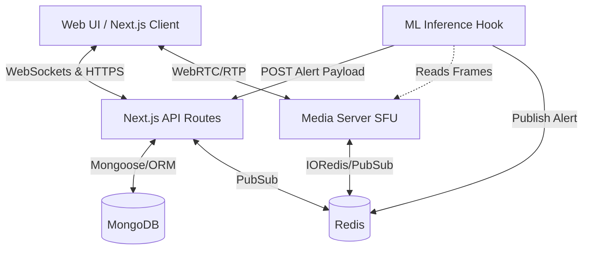
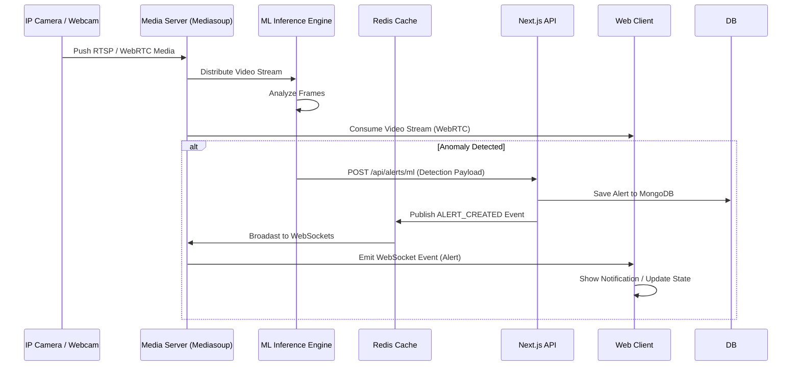

# HMS.SYS (Hostel Monitoring System)

> A brutalist, production-grade surveillance matrix engineered for autonomous threat apprehension.
> Powered by Mediasoup WebRTC, machine learning, and instantaneous WebSocket telemetry.

---

## ⚡ System Architecture

HMS.SYS is designed symmetrically—decoupling high-intensity media processing from the rapid tactical web client.



1. **The Tactical UI (`apps/web`)**: A stark, hyper-efficient Next.js dashboard that visualizes active zones, aggregates live anomalies, and renders WebRTC video dynamically. It uses Zustand for synchronous state resolution securely over HTTP and WebSockets.
2. **The SFU Router (`apps/media-server`)**: Built over explicit Mediasoup C++ worker threads. It handles routing and amplifying IP camera streams (ingested natively or via FFmpeg) directly into consumer viewing ports without congesting general HTTP traffic. Uniquely interfaces via WebSocket for signaling.
3. **The ML Inference Webhook**: An isolated channel. External detection algorithms continuously scan video frames passively. Upon detecting an anomaly (e.g., `UNAUTHORIZED_PERSON`, `WEAPON`), they drop payload instructions securely to the HMS webhook. This immediately publishes via Redis to all connected endpoints.

---

## 🌊 Data Flow Pipeline



---

## 📸 Connecting & Simulating Camera Streams

Since real-world IP Hardware isn't always available during development, the UI enables "Simulate Camera" webcam streaming directly from your browser.

### The Mechanism
1. The web interface utilizes `navigator.mediaDevices.getUserMedia({ video: true, audio: false })` to capture your local laptop webcam.
2. It sends a `produce` request to the Media Server via WebSockets.
3. The Media Server generates a Mediasoup *Producer* object wrapping your stream track. 
4. Other connected clients on that floor automatically receive a `PRODUCER_ADDED` event and natively consume the WebRTC feed inside their browser.

### Using External RTSP 
To ingest an external camera:
- Push an active RTSP feed into the `media-server` via `ffmpeg`.
- A dedicated ingest port dynamically handles incoming UDP tracks and relays them to Mediasoup.

*(If you are clicking the **Simulate Camera** button in the Web Client, assure your browser explicitly allows camera permissions for localhost).*

---

## 📦 Turborepo Structure

This project uses Turborepo to efficiently orchestrate multiple workspaces:

*   **`apps/web`**: The main Next.js tactical UI. Handles all dashboard visuals, API routing, NextAuth, and WebSocket consumer logic.
*   **`apps/media-server`**: Standalone Node.js daemon. Runs Mediasoup WebRTC and independent WebSocket servers strictly for signaling and stream multiplexing.
*   **`packages/db`**: Shared database schemas containing Mongoose connections and data models. Connects the web and media server seamlessly.
*   **`packages/types`**: Shared TypeScript definitions preventing structural drift between the Next.js UI and the Media Server payloads.
*   **`packages/ui`**: Reusable front-end elements structurally sound across the monolith, implementing brutalist styling via Tailwind and Framer Motion.

---

## 🧩 Key Dependencies

The system relies on specific performance-oriented packages:

*   **`next`, `next-auth`**: Foundation web framework and JWT-based authentication logic.
*   **`mongoose`, `dotenv`**: MongoDB ORM layer for flexible document persistence and environment configuration.
*   **`zustand`**: State management in the frontend. Ultra-lightweight and reactive.
*   **`mediasoup-client`, `mediasoup`**: WebRTC SFU engine for managing fast parallel video streams.
*   **`ioredis`**: Asynchronous Redis client for realtime event Pub/Sub distribution across our microservices.
*   **`ws`**: Raw WebSocket servers for live signaling in the media server.
*   **`framer-motion`**: High performance hardware-accelerated animations for the brutalist client-side UI.
*   **`clsx`, `tailwindcss`**: Efficient utility-class composition and styling matrix.
*   **`bcryptjs`, `uuid`**: Security encoding and unique identifier generation algorithms.
*   **`turbo`, `tsx`, `tsc`**: Internal build-tooling, executing monorepo cache commands, and checking strict TypeScript engines.

---

## 🔒 Security Posture

End-to-end encryption is respected.

*   **At Rest**: MongoDB handles flexible but secure document persistence. Mongoose schemas validate strictly between Hostels, Node cameras, and User entities.
*   **In Transit**: NextAuth mandates JWT token authentication with strictly segregated RBAC (Role-Based Access Control) bounds.
*   **Media Channels**: Mediasoup dictates strict DTLS and SRTP constraints, sealing RTP payloads between the relay host and authorized connected browsers.

---

## 🚀 Quickstart Matrix

### 1. Prerequisites (Strict Requirements)
Your host bare-metal or cloud instance **must** run:
- Node.js (v18+)
- MongoDB (Active Local Service or Atlas Cluster)
- Redis Server (Active Local Service)
- **FFmpeg**: Required exclusively by the media-server to transcode external RTSP.
- **Python / Build Essentials**: To compile the Mediasoup node-addon (e.g. `xcode-select --install` or `build-essential`).

### 2. Clone & Install
Clone the matrix locally and install dependencies globally across the monorepo workspaces:
```bash
git clone <repository_url> hms-sys
cd hms-sys
npm ci
```

### 3. Environment Configurations
Duplicate `.env.example` to `.env` in the root (or `packages/db/.env` where appropriate) and configure your connection strings:
```env
# Database Links
DATABASE_URL="mongodb://localhost:27017/hostel_monitor"
REDIS_URL="redis://localhost:6379"

# Security 
NEXTAUTH_SECRET="long-b64-string-never-leak"
NEXTAUTH_URL="http://localhost:3000"

# Media Server Setup
NEXT_PUBLIC_MEDIA_SERVER_WS_URL="ws://localhost:4000"
ANNOUNCED_IP="127.0.0.1" # CRITICAL: Set to LAN/WAN IP for cross-device feeds.
RTC_MIN_PORT=40000
RTC_MAX_PORT=49999
```

### 4. Database Genesis
Seed the newly connected MongoDB cluster to populate the initial base state arrays.
```bash
npm run db:seed  # Generates default admins, hostels, and cameras
```
> Default Admin credentials generated via seed: `admin@hostel.com` / `password123`

### 5. Engage Engines
Start the entire Turborepo simultaneously.
```bash
npm run dev
```

---

## 📡 API Routing Layer

The API guarantees strict REST-based JSON formats.

*   `GET /api/hostels` - Yields total system overviews.
*   `GET /api/hostels/:hostelId` - Deep floor-by-floor breakdown.
*   `GET /api/cameras/:cameraId` - Extensive context on a target Node.
*   `POST /api/alerts/ml` - Root intake for Machine Learning (Secured globally).
*   `GET /api/alerts` - Filtered threat history search.
*   `PATCH /api/alerts/:alertId/resolve` - Dispatch resolution and archive the threat.

---

## 🛠 WebRTC / SFU Connectors 

Client WebSocket logic negotiates the connection protocol linearly:
1.  **`JOIN_FLOOR`**: Identify connection constraints and map to right floor bounds.
2.  **`GET_ROUTER_RTP_CAPABILITIES`**: Transmit browser media codecs strictly.
3.  **`CREATE_RECV_TRANSPORT`**: Finalize DTLS tunnel handshakes with the Media Server.
4.  **`CONSUME`**: Explicitly demand streams belonging to active `producerId` values.

Events such as `PRODUCER_ADDED` or `PRODUCER_REMOVED` force tactical UI refreshes asynchronously.
